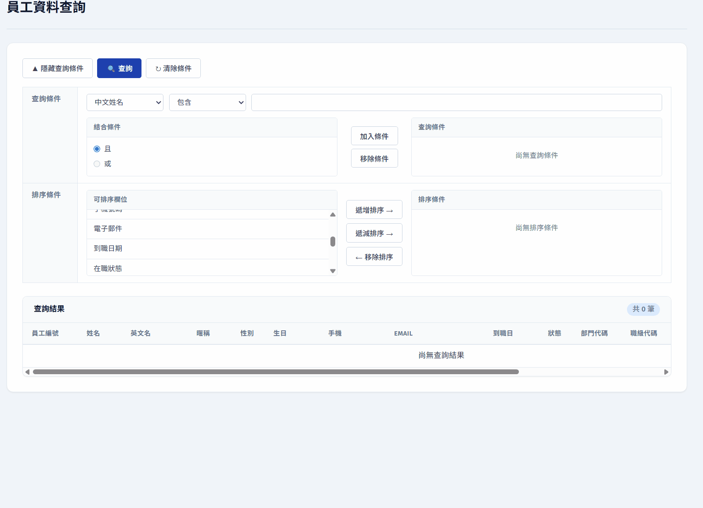
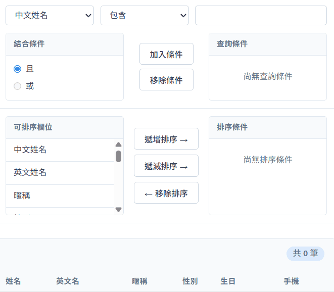
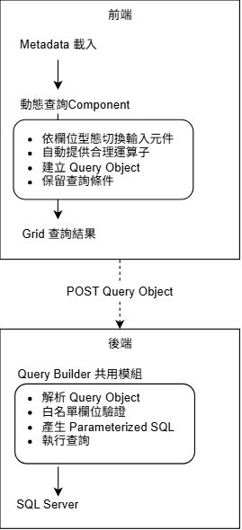

# React + .NET Core 動態查詢模組

### Metadata Driven Query Component

以 **Metadata Driven** 為核心理念，打造一套可重複使用的企業級動態查詢元件。

---

## 專案動機

在企業管理系統中，幾乎每個模組都有「查詢頁」——關鍵字、日期區間、下拉條件、組合過濾、排序、結果顯示。
過去每多一個查詢功能，就要從頭刻一次 UI、條件邏輯與 API 串接，
導致 **重複開發成本高、維護分散、使用者體驗不一致**。

本專案的核心目標不是再做一個查詢頁，而是建立一套 **設定即介面（Metadata as UI）** 的共用模組，
從根本上消除「重複造輪子」的問題。

---

## Demo 預覽

> 以下為實機操作錄影，展示模組的核心使用場景。

### 🧩 動態渲染查詢介面
> 同一份 `DynamicQueryBox` Component，只要透過後端傳入的 **Metadata** 設定，
> 就能動態決定要顯示哪些查詢欄位、使用哪種輸入元件、提供哪些運算子。
>
> 換句話說，**前端不需要為每個查詢頁撰寫專屬的表單程式碼**——
> 新增一個查詢功能，只需要在 Metadata 設定表新增對應紀錄即可生成完整查詢頁面。

---

### 🎬 自訂查詢條件（AND / OR 巢狀組合）
> 使用者可自行組合欄位、運算子、值，並透過縮排視覺呈現 AND / OR 的優先順序。

---

### 🎬 多元件類型（下拉 / Radio / CheckBox / 日期 / 彈出視窗）
> COMPONENT_TYPE 驅動：同一個查詢框會根據欄位型態自動切換最合適的輸入元件。

---

## 專案亮點

### 1️⃣ Metadata Driven — 設定即介面

將「可查詢欄位、資料型態、運算子、UI 元件類型」全部抽離為資料庫設定，
新增一個查詢功能 **不需要寫任何前端表單程式碼**，只需新增 Metadata 記錄即可。

| 項目 | 改善前 | 改善後 |
|---|---|---|
| 新增查詢頁 | 約 2 個工作天 | **約 2 小時** |
| 查詢 UI | 每頁重新開發 | **共用 Component** |
| 查詢條件 | 固定寫死 | **Metadata 動態生成** |
| 使用者需求調整 | 每頁個別修改 | **統一調整 Component** |
| 自訂查詢條件 | 無 | **使用者可自行組合欄位、運算子與排序** |

---

### 2️⃣ 三層架構，職責清晰

- **設定層**：以資料表管理可查詢欄位、運算子、元件類型
- **前端展示層**：`DynamicQueryBox` 為單一進入點，呼叫端僅需傳入 `tableName` 與 `queryApi`
- **後端共用層**：自訂 Query Builder 將結構化查詢條件轉為安全 SQL

**Sequence Diagram — 查詢資料流**

---

### 3️⃣ 安全性優先（Security by Design）

針對動態查詢最大的風險——**SQL Injection**——設計四層防禦：

| 防禦層 | 做法 |
|---|---|
| 🛡️ **欄位白名單** | 後端從 Metadata 取得允許查詢的欄位清單，過濾掉未授權欄位 |
| 🛡️ **運算子白名單** | 以 Enum 限制合法運算子，前端傳入值必須能對應到 `QueryOperatorEnum` |
| 🛡️ **Parameterized Query** | 所有使用者輸入皆透過 `@parameter` 帶入，杜絕 SQL Injection |
| 🛡️ **前端不傳 SQL** | 前端僅傳遞結構化 Query Object，SQL 由後端組裝 |

> **設計原則**：絕不相信任何來自前端的字串。前端只負責「結構化描述需求」，後端 100% 主導 SQL 生成。

---

### 4️⃣ 技術選型權衡

> 為何不直接使用 EF Core / Dynamic LINQ？

在動態查詢的實作上考量過 EF Core 的 `Dynamic LINQ` 方案，最終選擇自行實作 Query Builder，理由如下：

- ✅ 企業內部 SQL 經常包含 `dbo.FN_GetXxx()` 等自訂函數與 `NOLOCK` Hint，EF Core 難以直接支援
- ✅ 需要對欄位與運算子做嚴格的白名單控制，自建 Query Builder 在驗證層更靈活
- ✅ 團隊既有 **Dapper + Raw SQL** 慣例，自行實作的學習成本與維運成本更低
- ✅ 可對不同企業情境進行最佳化

---

### 5️⃣ 真實情境下的挑戰

#### 邏輯歧異：AND / OR 混合條件的括號處理
使用者可自由組合 `(姓名 包含 王 OR 姓名 包含 李) AND (薪資 >= 30000)`，
若僅依序串接查詢條件，會因 AND / OR 的運算優先順序不同，產生邏輯歧異，導致實際查詢結果與使用者預期不符。

**解法**：以前端縮排視覺呈現條件群組，
讓使用者一眼看出每組查詢的邊界；轉譯 SQL 時，依據縮排層級控制括號位置，
達到 **「畫面所見即查詢結果」** 的一致體驗。

---

## 成效摘要

- ⏱️ **新增查詢頁時間**：2 工作天 → **2 小時內**（約節省 90% 開發時間）
- 🔁 **重複程式碼**：每頁獨立開發 → **單一共用 Component**
- 🎨 **使用者體驗**：各頁面查詢風格不一 → **全系統統一查詢體驗**
- 🔒 **安全性**：固定查詢條件 → **彈性且支援複雜查詢條件**
- 🧩 **延展性**：使用者可自行組合欄位、運算子、排序

---

## 關於

本專案為個人作品集，展示在企業系統情境下，如何透過 **Metadata Driven** 的思維，
將重複性高的查詢頁開發抽象為可重複使用的共用模組，
並在動態彈性與安全性之間取得平衡。

> 📌 **重要說明**：本專案原始碼為個人作品集私有專案，**不對外公開**。
